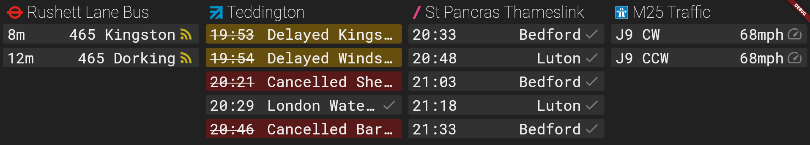

# Second departure board



I made this as a quick heads-up display installed in my workplace that can display all of the public transportation and road traffic around the office. This is the second version made in flutter and dart ([the first one used PySide6/Qt](https://github.com/lprib/departure-board)). The first departure board displayed a single mode of transport per page and flipped between pages on a timer. This caused people to need to wait for a few seconds until their mode of transport appeared and only allowed a few seconds of viewing until the next page flipped.

This improves the UX by displaying everything in a condensed fasion on a single static screen to allow quick heads-up reading at a glance. It supports

1. [TfL API](https://api-portal.tfl.gov.uk/api-details#api=StopPoint) for querying bus arrival times at arbitrary stops. Multiple stops can be shown with arrivals merged in a single column.
2. [Live Departure Boards Web Service (LDBWS / OpenLDBWS)](https://lite.realtime.nationalrail.co.uk/OpenLDBWS/) for querying train times. Multiple stations can be concatenated per column, or a single station can be filtered by stop code. For example, we use this to show a column of only the Thameslink departures from Wimbledon station, as some people use this as a connection.
3. A reverse-engineered API from Traffic England for displaying average speed on any motorway in England. This was not documented but has been reconstructed by looking at the newwork requests from [this site](https://www.trafficengland.com/traffic-report).


Delayed busses, trains, or slow traffic will show in degraded (yellow) or cancelled (red) colouring, along with the new departure time or cancellation.


## Configuration of columns
For simplicity, the configuration is currently baked in to the build (since we will always use the same settings for the workplace). In main.dart:
```dart
final state = TrainboardState([
  TflBusDepartureService(
    // obtained from OpenStreetMap
    naptanCodes: ["490011796S", "490011796N"],
    name: "Rushett Lane Bus",
    commonLocationNames: {"Dorking, Deepdene": "Dorking"},
  ),
  LdbwsService(
    // standard station CRS code
    crs: "TED",
    // Display name
    name: "Teddington",
    logo: StationLogo.southWesternRailway,
    reportDestination: true,
  ),
  LdbwsService(
    crs: "STP",
    name: "St Pancras Thameslink",
    logo: StationLogo.thamesLink,
    // Standard train operator code (TL = Thameslink)
    operatorCodeFilter: "TL",
    reportDestination: true,
  ),
  TrafficEnglandService(
    name: "M25 Traffic",
    // names and motorways are pretty self explanatory but can be obtained by looking at the response JSON format
    reportSpecs: [
      TrafficReportSpec(
        name: "J9 CW",
        motorway: "M25",
        fromJunctionName: "J9",
        toJunctionName: "J8",
      ),
      TrafficReportSpec(
        name: "J9 CCW",
        motorway: "M25",
        fromJunctionName: "J9",
        toJunctionName: "J10",
      ),
    ],
  ),
], depRowLimit: 5);
```